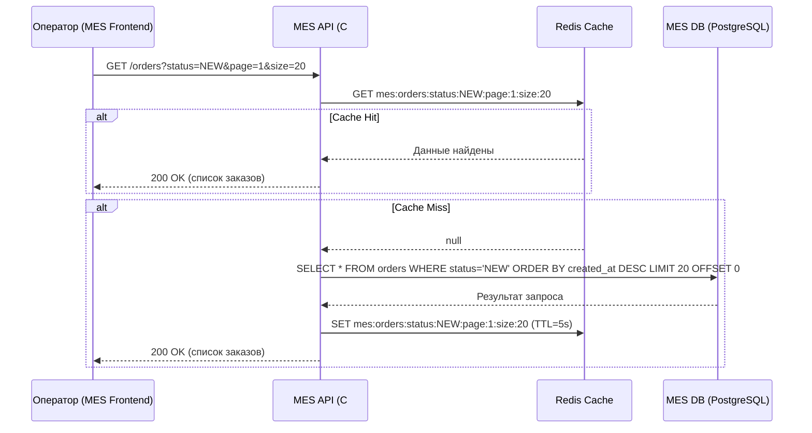
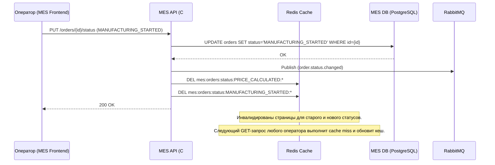

# Архитектурное решение по кешированию

## Мотивация

### Проблемы

1. **Медленная загрузка дашборда MES.** Операторы жалуются, что первая страница MES (список заказов по статусам с фильтром и пагинацией) долго прогружается. Каждый запрос оператора выполняет тяжёлый SQL-запрос к MES DB (PostgreSQL) с фильтрацией по статусам, сортировкой по дате и пагинацией. С ростом количества заказов (+100 в месяц) объём таблицы увеличивается, индексы растут, а запросы замедляются. При этом множество операторов запрашивают одни и те же данные (новые заказы), создавая дублирующую нагрузку на базу.

2. **Нагрузка на MES API от внешних API-клиентов.** После открытия API для внешних продавцов ювелирных изделий количество запросов к MES API значительно выросло. MES API обрабатывает расчёт стоимости (2–30 минут на заказ) и одновременно отдаёт данные для дашборда — эти нагрузки конкурируют за ресурсы одного инстанса.

3. **Повторные вычисления стоимости.** Если несколько клиентов заказывают изделие с одинаковой или похожей 3D-моделью, MES пересчитывает стоимость каждый раз заново, расходуя вычислительные ресурсы.

### Какие элементы системы планируется включить в кеширование

| Элемент                                      | Обоснование                                                                                                                        |
| -------------------------------------------- | ---------------------------------------------------------------------------------------------------------------------------------- |
| **Список заказов MES (дашборд)**             | Самая частая операция чтения, выполняемая всеми операторами. Высокий ratio чтения к записи. Прямое влияние на жалобы операторов.   |
| **Результаты расчёта стоимости**             | Расчёт занимает 2–30 минут. Кеширование результата по хешу 3D-модели позволит мгновенно отдавать стоимость для повторных запросов. |
| **Каталог готовых изделий (онлайн-магазин)** | Данные каталога редко изменяются, но запрашиваются каждым посетителем сайта.                                                       |

### Ожидаемый эффект

- Снижение времени загрузки дашборда MES с нескольких секунд до < 200 мс.
- Снижение нагрузки на MES DB на 60–80% за счёт обслуживания повторяющихся запросов из кеша.
- Мгновенная выдача стоимости для повторных 3D-моделей вместо повторного расчёта (2–30 минут).
- Повышение отзывчивости онлайн-магазина для конечных клиентов.

---

## Предлагаемое решение

### Выбор типа кеширования

Предлагается **серверное кеширование** на уровне MES API и Shop API с использованием **Redis** в качестве кеш-хранилища.

**Почему серверное, а не клиентское:**

| Критерий                    | Клиентское кеширование                                                                             | Серверное кеширование                                                  |
| --------------------------- | -------------------------------------------------------------------------------------------------- | ---------------------------------------------------------------------- |
| Консистентность             | Каждый клиент видит свою версию данных, сложно инвалидировать                                      | Единый источник кешированных данных, централизованная инвалидация      |
| Масштабируемость            | Не снижает нагрузку на базу при большом количестве уникальных клиентов                             | Один запрос к БД обслуживает все последующие запросы всех клиентов     |
| Актуальность данных         | Клиент может работать с устаревшими данными (критично для операторов MES, конкурирующих за заказы) | Данные актуальны для всех пользователей одновременно после инвалидации |
| Применимость к API-клиентам | Невозможно контролировать поведение внешних API-клиентов                                           | Полностью контролируемое решение на стороне сервера                    |

### Выбор паттерна кеширования

#### Для дашборда MES — **Cache-Aside (Lazy Loading)**

Паттерн Cache-Aside выбран как основной для кеширования списка заказов.

**Как работает:**
1. MES API получает запрос на список заказов с фильтром по статусу и параметрами пагинации.
2. MES API проверяет наличие данных в Redis по составному ключу.
3. Если данные найдены (cache hit) — возвращает их клиенту.
4. Если данных нет (cache miss) — выполняет запрос к MES DB, сохраняет результат в Redis с TTL и возвращает клиенту.

**Почему Cache-Aside оптимален:**
- Операторы конкурируют за новые заказы — допустимая задержка актуальности составляет 3–5 секунд, что покрывается коротким TTL.
- Основная нагрузка — чтение одних и тех же страниц (первая страница, статус «новые»). Cache-Aside эффективен именно при таком паттерне доступа.
- Минимальные изменения в коде MES API (C#) — добавление слоя кеширования без изменения логики записи.

### Диаграмма последовательности

#### Чтение списка заказов (дашборд MES)

#### Изменение статуса заказа (с инвалидацией кеша)

### Стратегия инвалидации кеша

Предлагается **комбинированная стратегия: программная инвалидация + TTL (временная).**

#### Сравнение стратегий инвалидации

| Критерий                      | TTL (временная)                                                                                                | По ключу (программная)                                                                                                  | Комбинированная (TTL + программная)                                             | Event-driven (через RabbitMQ)                                                       |
| ----------------------------- | -------------------------------------------------------------------------------------------------------------- | ----------------------------------------------------------------------------------------------------------------------- | ------------------------------------------------------------------------------- | ----------------------------------------------------------------------------------- |
| **Консистентность**           | Низкая — данные устаревают на время TTL                                                                        | Высокая — кеш инвалидируется сразу при изменении                                                                        | **Высокая** — немедленная инвалидация при записи + TTL как страховка            | Высокая, но зависит от доставки сообщений                                           |
| **Сложность реализации**      | Минимальная — только установка TTL                                                                             | Средняя — нужно инвалидировать при каждой операции записи                                                               | **Средняя** — сочетание обоих подходов                                          | Высокая — требует подписки на события, обработки сбоев доставки                     |
| **Защита от утечек памяти**   | Да — данные автоматически удаляются                                                                            | Нет — «забытые» ключи остаются навсегда                                                                                 | **Да** — TTL гарантирует очистку                                                | Нет — без дополнительного TTL ключи могут накапливаться                             |
| **Подходит для дашборда MES** | Частично — короткий TTL (3–5 с) приемлем, но при частых обновлениях статусов операторы видят устаревшие данные | Частично — при смене статуса заказа нужно удалять ключи для двух статусов (старый и новый), но без TTL есть риск утечки | **Да** — программная инвалидация при смене статуса + короткий TTL как страховка | Избыточно — MES API сам меняет статусы, нет необходимости в асинхронном уведомлении |

### Технологический выбор: Redis

**Почему Redis:**
- Поддерживается в Yandex Cloud как Managed Service — минимальные затраты на эксплуатацию (один DevOps-инженер в команде).
- Поддержка TTL, паттерн-удаления ключей, атомарных операций.
- Latency чтения < 1 мс — достаточно для требуемых < 200 мс на дашборде.
- Один инстанс Redis может обслуживать и MES API, и Shop API (логическое разделение через префиксы ключей).
